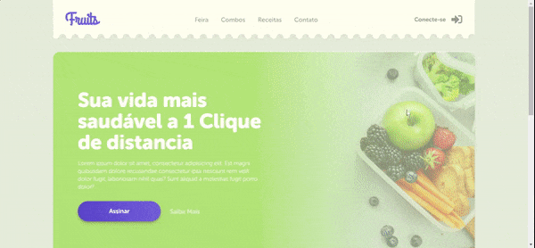

# Fruts
E-commerce de Frutas

Fruits é um projeto que visa disponibilizar ao publico a possibilidade de compra online de frutas frescas. O projeto demanda um sistema que contemple a oferta de assinatura mensal, compra por varejo de unidades ou pacotes prontos. 

Demandas do Projeto
<pre>
🔄 Front-End

  🔄 Site 
    ✔️ Area destacando serviço de assinatura. 
    ✔️ Area para o catalogo de produtos por unidade. 
    👨‍💻 Area para catalogo de pacotes de produtos. 
    ❌ Area para publicação de receitas feitas com os produtos vendidos. 
    ❌ Rodapé com informações tecnicas e judiciais. 
    ❌ Carrinho flutuante na parte inferior direito da página 
    ⏸️ Responsivo 
    ⏸️ Animações 
</pre>
Back-End

  <pre>
  ⏸️ Back-End 
    ⏸️ Sistema de Login 
        ⏸️ Area de Clientes 
             ⏸️ Acomapanhar Transições 
             ⏸️ Configurar Informações Pessoais 
             ⏸️ Configurar Informações de Pagamento e Entrega 
             ⏸️ Configurar Plano de Assinatura 
        ⏸️ Area do Administrativo 
             ⏸️ Configurar Informações Pessoais 
             ⏸️ Cadastrar Produtos 
             ⏸️ Configurar informações de Produtos Cadastrados 
             ⏸️ Publicar receitas no site 
             ⏸️ Configurar Usuarios Cadastrados 
    ⏸️ Sistema de Pagamento Vinculado ao Sistema de Membros </pre>

Arquivos
<pre></pre>
